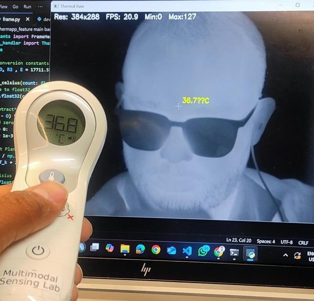
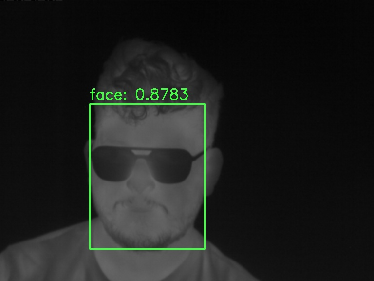

# ThermApp Thermal Imaging Application  

A Python-based thermal imaging application built for the **ThermApp thermal camera**.  
This project was developed during my internship at the **Multimodal Sensing Lab, Center for Machine Vision and Signal Analysis (CMVS), University of Oulu**, under the supervision of **Dr. Constantino Álvarez Casado** and **Associate Professor Miguel Bordallo López**.  

The system connects directly to the ThermApp device, streams raw thermal frames via USB, applies calibration, displays real-time thermal images, and enables **temperature extraction** at the pixel level. An additional module integrates **YOLOv11** for automatic face detection on thermal video streams.  

---

## 🚀 Features  

- **USB Device Communication**  
  - Opens/closes ThermApp device using `libusb`.  
  - Handles control transfers and error recovery.  

- **Configuration Management**  
  - Device parameters managed with a `ConfigPackage`.  
  - Supports default initialization and dynamic updates.  

- **Frame Acquisition & Processing**  
  - Extracts valid frames with headers and pixel data.  
  - Parses raw ADC counts into 16-bit arrays.  

- **Calibration & Noise Reduction**  
  - Initial flat-field calibration (average of 50 frames).  
  - Global offset adjustment for stable brightness.  

- **Real-Time Display**  
  - Live thermal imaging with FPS, resolution, and pixel stats.  
  - Mouse-hover overlay for pixel temperature (°C).  
  - Dataset saving at specified frame intervals.  

- **Temperature Extraction**  
  - Raw-to-°C conversion using **Planck’s law inversion**.   

- **Face Detection (YOLOv11)**  
  - Auto-detects faces in thermal frames.  
  - Draws bounding boxes in real time.  
  - Extensible to vital signs monitoring and healthcare applications.  

---

## 📂 Project Structure  

├── application.py # Main thermal imaging application
├── device.py # ThermApp device communication
├── config.py # Device configuration management
├── constants.py # Frame and USB constants
├── data_processing.py # Frame parsing and processing
├── frame.py # Frame reader & display thread
├── queue_handler.py # Data queue management
├── main.py # Entry point for running application
├── metadata_to_temperature.py # Offline raw-to-temperature converter
└── README.md # Project documentation

### Requirements
Check and install the required driver; you can use "Zadig - USB driver installation ".
- Python 3.9+

  

👨‍💻 Author

Mohammad Rakibur Rahman  
Master’s student, Computer Science and Engineering  
University of Oulu

Supervised by:

- Dr. Constantino Álvarez Casado (Multimodal Sensing Lab)

- Associate Professor Miguel Bordallo López (Head of Lab)

Contributor
- Dr. Sasan Sharifipour (Multimodal Sensing Lab)

